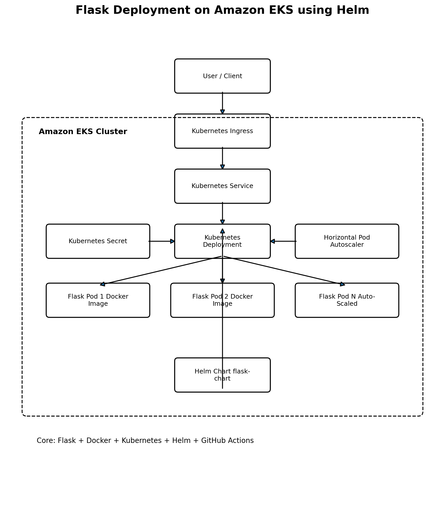
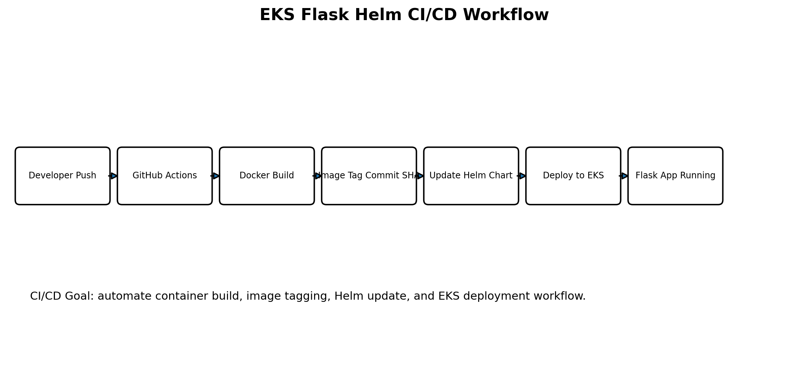

# Flask Application Deployment on Amazon EKS using Docker, Kubernetes, Helm, and GitHub Actions

A Cloud DevOps project that containerizes a Flask application using Docker and deploys it to Amazon EKS using Kubernetes manifests, Helm charts, and GitHub Actions CI/CD automation.

---

## Project Overview

This project demonstrates a complete containerized deployment workflow for a Python Flask application on Kubernetes.

The application is packaged using Docker, deployed using Kubernetes manifests, managed using Helm charts, and automated with GitHub Actions. The project also includes Kubernetes resources such as Deployment, Service, Ingress, Secret, and Horizontal Pod Autoscaler.

---

## Key Features

- Containerized Flask application using Docker
- Kubernetes deployment manifests
- Helm chart for reusable Kubernetes deployment
- GitHub Actions CI/CD workflow
- Kubernetes Service for internal/external access
- Ingress configuration for routing
- Horizontal Pod Autoscaler support
- Kubernetes Secret template
- IAM policy file for AWS permissions
- Optional Kafka development manifest

---

## Architecture Diagram



---

## CI/CD Workflow Diagram



---

## Architecture

```text
Developer Push
      |
      v
GitHub Repository
      |
      v
GitHub Actions
      |
      v
Docker Build
      |
      v
Container Image Tagging
      |
      v
Helm Chart Update
      |
      v
Amazon EKS Cluster
      |
      +--> Kubernetes Deployment
      +--> Kubernetes Service
      +--> Ingress
      +--> HPA
      +--> Secret
```

---

## Tech Stack

| Category | Technology |
|---|---|
| Programming Language | Python |
| Web Framework | Flask |
| Containerization | Docker |
| Orchestration | Kubernetes |
| Kubernetes Package Manager | Helm |
| Cloud Platform | AWS EKS |
| CI/CD | GitHub Actions |
| Configuration | YAML |
| Optional Messaging | Kafka Dev Manifest |

---

## Project Structure

```text
eks-flask/
├── app.py
├── Dockerfile
├── requirements.txt
│
├── deployment.yaml
├── service.yaml
├── ingress.yaml
├── kafka-dev.yaml
├── iam_policy.json
│
├── flask-chart/
│   ├── Chart.yaml
│   ├── values.yaml
│   ├── charts/
│   └── templates/
│       ├── deployment.yaml
│       ├── hpa.yaml
│       ├── secret.yaml
│       └── service.yaml
│
├── docs/
│   ├── architecture.png
│   └── workflow.png
│
└── README.md
```

---

## Application

The Flask application is defined in:

```text
app.py
```

It is containerized using:

```text
Dockerfile
```

Dependencies are managed through:

```text
requirements.txt
```

---

## Docker Build

Build the Docker image:

```bash
docker build -t flask-eks-app .
```

Run locally:

```bash
docker run -p 5000:5000 flask-eks-app
```

---

## Kubernetes Deployment

Apply Kubernetes manifests manually:

```bash
kubectl apply -f deployment.yaml
kubectl apply -f service.yaml
kubectl apply -f ingress.yaml
```

Check resources:

```bash
kubectl get pods
kubectl get svc
kubectl get ingress
```

---

## Helm Deployment

Install using Helm:

```bash
helm install flask-app ./flask-chart
```

Upgrade deployment:

```bash
helm upgrade flask-app ./flask-chart
```

Uninstall:

```bash
helm uninstall flask-app
```

---

## GitHub Actions CI/CD

The project includes GitHub Actions automation for deployment workflow.

Typical workflow:

```text
Code Push
   |
   v
GitHub Actions Trigger
   |
   v
Build Docker Image
   |
   v
Tag Image with Commit SHA
   |
   v
Update Helm Chart Image Tag
   |
   v
Deploy to EKS
```

---

## Kubernetes Resources

| Resource | Purpose |
|---|---|
| Deployment | Runs Flask application pods |
| Service | Exposes Flask pods inside the cluster |
| Ingress | Routes external traffic |
| HPA | Scales pods based on resource usage |
| Secret | Stores sensitive configuration |
| Helm Chart | Packages Kubernetes resources |

---

## Important Security Note

The repository contains:

```text
terraform.tfstate
```

Terraform state files can contain sensitive information and should not be committed to public repositories.

Recommended action:

1. Remove `terraform.tfstate` from GitHub.
2. Add it to `.gitignore`.
3. Use S3 remote backend and DynamoDB state locking for real projects.

Add this to `.gitignore`:

```text
terraform.tfstate
terraform.tfstate.*
.terraform/
*.tfvars
```

---

## Future Improvements

- Push Docker image to Amazon ECR
- Add full EKS provisioning using Terraform
- Add HTTPS with AWS Load Balancer Controller and ACM
- Add monitoring using Prometheus and Grafana
- Add centralized logs using CloudWatch Logs
- Add resource requests and limits
- Add blue-green or canary deployment
- Add automated rollback on failed deployment
- Add Kubernetes namespace separation for dev/stage/prod

---

## Learning Outcomes

Through this project, I gained hands-on experience in:

- Flask application containerization
- Docker image creation
- Kubernetes Deployments and Services
- Helm chart structure
- GitHub Actions CI/CD workflow
- EKS deployment concepts
- Kubernetes scaling using HPA
- Cloud-native deployment workflow
- DevOps project structuring

---

## Author

**Vishwa Sabaris V**

B.E. Computer Science and Engineering (Artificial Intelligence & Machine Learning)

Kalaignar Karunanidhi Institute of Technology (KIT), Coimbatore
